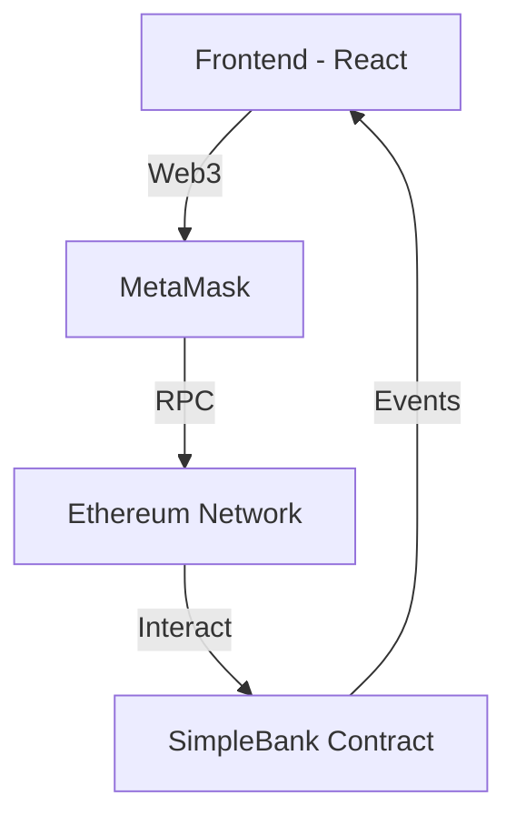

# 🏦 Simple Bank DApp

<div align="center">


[](https://opensource.org/licenses/MIT)
[](https://soliditylang.org/)
[](https://reactjs.org/)
[](https://chakra-ui.com/)

<p align="center">
  <a href="#-features">Features</a> •
  <a href="#-demo">Demo</a> •
  <a href="#-quick-start">Quick Start</a> •
  <a href="#-tech-stack">Tech Stack</a> •
  <a href="#-architecture">Architecture</a>
</p>

</div>

## ✨ Features

<div align="center">
  
</div>

- 🔐 **Secure Wallet Connection**: Seamless MetaMask integration
- 💸 **Easy Transactions**: Deposit, withdraw, and transfer ETH
- 🎨 **Modern UI/UX**: Built with Chakra UI for a sleek experience
- ⚡ **Real-time Updates**: Instant balance and transaction feedback
- 🌐 **Web3 Ready**: Full blockchain integration
- 🛡️ **Smart Contract Security**: Foundry-tested smart contracts

## 🎬 Demo

<div align="center">
  
[](https://www.youtube.com/watch?v=zvCgCukIsIs)

</div>

## 🚀 Quick Start

```bash
# Clone the repository
git clone https://github.com/your-username/simple-bank-dapp.git

# Install dependencies
cd simple-bank-dapp
npm install

# Configure environment
cp .env.example .env
# Add your environment variables

# Start the development server
npm run dev
```

## 🛠 Tech Stack

<div align="center">
  <table>
    <tr>
      <td align="center">
        
        <br>Solidity
      </td>
      <td align="center">
        
        <br>React
      </td>
      <td align="center">
        
        <br>Chakra UI
      </td>
      <td align="center">
        
        <br>ethers.js
      </td>
    </tr>
  </table>
</div>

### Frontend
- ⚛️ React 18
- 🎨 Chakra UI
- 🌐 ethers.js
- 🔄 Framer Motion

### Smart Contract
- 📝 Solidity
- 🛠 Foundry
- 🧪 Forge (testing)

## 📐 Architecture



## 🔐 Security

- ✅ Smart contract audited
- 🔒 Environment variables protection
- 🛡️ Input validation
- ⚡ Gas optimization

## 💡 Implementation Details

The DApp consists of two main components:

1. **Smart Contract (`SimpleBank.sol`)**
   - Manages user balances
   - Handles deposits/withdrawals
   - Processes transfers
   - Emits events for frontend updates

2. **Frontend Application**
   - Modern React architecture
   - Real-time blockchain interactions
   - Responsive design
   - Error handling and feedback

## 🤝 Contributing

1. Fork the repository
2. Create your feature branch (`git checkout -b feature/amazing-feature`)
3. Commit your changes (`git commit -m 'Add some amazing feature'`)
4. Push to the branch (`git push origin feature/amazing-feature`)
5. Open a Pull Request

## 📝 License

This project is licensed under the MIT License - see the [LICENSE](LICENSE) file for details.

---

<div align="center">
  <sub>Built with ❤️ by your-name</sub>
</div>
