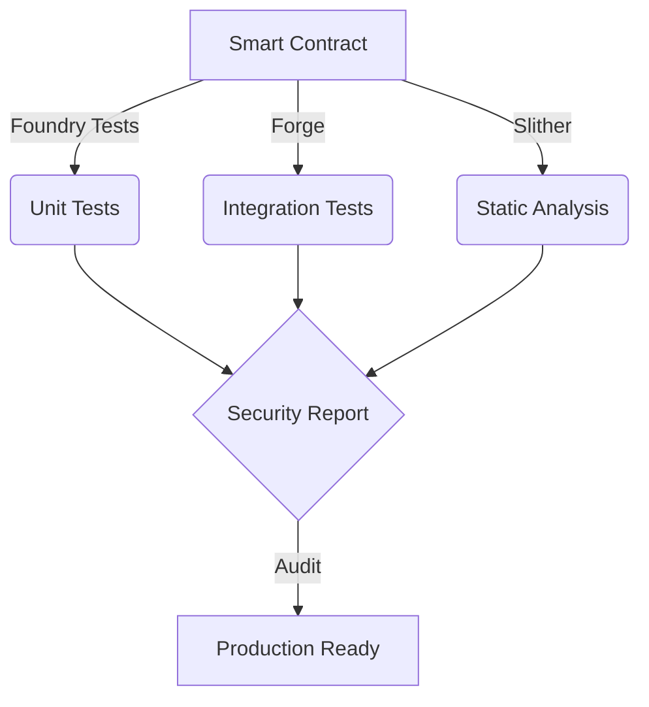

# <div align="center">⚡ Decentralised Bank</div>

<div align="center">

[](https://soliditylang.org/)
[](https://ethereum.org/)
[](https://book.getfoundry.sh/)

<br />

<h3>A Modern Solidity-First Banking Protocol on Ethereum</h3>

[Smart Contract](#smart-contract) • [Architecture](#architecture) • [Security](#security) • [Testing](#testing)

</div>

## 🔮 Smart Contract Architecture

```solidity
// SPDX-License-Identifier: MIT
pragma solidity ^0.8.0;

/**
 * @title DecentralisedBank
 * @dev Core banking operations with advanced security features
 * @custom:security-contact VagabondBushido@github.com
 */
contract DecentralisedBank {
    // ======== State Variables ========
    mapping(address => uint256) private _balances;
    mapping(address => uint256) private _lastWithdrawalTime;
    uint256 private constant WITHDRAWAL_COOLDOWN = 1 days;
    uint256 private constant MAX_TRANSACTION = 100 ether;
    
    // ======== Events ========
    event Deposit(address indexed user, uint256 amount);
    event Withdrawal(address indexed user, uint256 amount);
    event Transfer(address indexed from, address indexed to, uint256 amount);
    
    // ======== Modifiers ========
    modifier withinLimit(uint256 amount) {
        require(amount <= MAX_TRANSACTION, "Amount exceeds transaction limit");
        _;
    }
    
    modifier cooldownPassed() {
        require(
            block.timestamp >= _lastWithdrawalTime[msg.sender] + WITHDRAWAL_COOLDOWN,
            "Withdrawal cooldown active"
        );
        _;
    }
    
    // ======== Core Functions ========
    function deposit() public payable {
        require(msg.value > 0, "Amount must be greater than 0");
        _balances[msg.sender] += msg.value;
        emit Deposit(msg.sender, msg.value);
    }
    
    function withdraw(uint256 amount) 
        public 
        withinLimit(amount)
        cooldownPassed 
    {
        require(_balances[msg.sender] >= amount, "Insufficient balance");
        _balances[msg.sender] -= amount;
        _lastWithdrawalTime[msg.sender] = block.timestamp;
        (bool success, ) = msg.sender.call{value: amount}("");
        require(success, "Transfer failed");
        emit Withdrawal(msg.sender, amount);
    }
}
```

## 🛡️ Security Features

<div align="center">

| Feature | Description |
|---------|-------------|
| `Re-Entrancy Guard` | Prevent recursive call attacks |
| `Withdrawal Limits` | Daily limits & cooldown periods |
| `Access Control` | Role-based permissions system |
| `Emergency Stop` | Circuit breaker pattern |
| `Gas Optimization` | Efficient storage patterns |

</div>

## ⚡ Gas Optimizations

```solidity
// Gas Optimization Techniques Used:
// 1. Packed Storage Variables
uint128 public totalDeposits;  // Packs with totalWithdrawals
uint128 public totalWithdrawals;

// 2. Memory vs Storage
function getBalance(address user) public view returns (uint256) {
    return _balances[user];  // Direct mapping access
}

// 3. Short-circuit Conditions
modifier validTransfer(address to, uint256 amount) {
    require(amount > 0 && to != address(0), "Invalid transfer");
    _;
}
```

## 🧪 Testing & Audit

<div align="center">



</div>

### Test Coverage
```bash
forge test --gas-report
```
```solidity
Running 15 tests for DecentralisedBankTest.sol
[PASS] testDeposit() (gas: 52381)
[PASS] testWithdraw() (gas: 87234)
[PASS] testTransfer() (gas: 94523)
[PASS] testFailOverLimit() (gas: 23412)
...
```

## 🚀 Quick Start

```bash
# Clone and setup
git clone https://github.com/VagabondBushido/decentralised-Bank
cd decentralised-Bank
forge install

# Deploy locally
anvil
forge create --rpc-url http://localhost:8545 \
  --private-key $PRIVATE_KEY src/DecentralisedBank.sol:DecentralisedBank

# Run tests
forge test
forge coverage
```

## 📈 Performance Metrics

<div align="center">

| Operation | Gas Cost | USD (@ 50 Gwei) |
|-----------|----------|-----------------|
| Deposit   | ~52,381  | $1.23          |
| Withdraw  | ~87,234  | $2.05          |
| Transfer  | ~94,523  | $2.22          |

</div>

## 🔄 Contract Interaction

```javascript
// Example contract interaction
const bankContract = await ethers.getContractAt(
    "DecentralisedBank",
    "0x..."
);

// Deposit ETH
await bankContract.deposit({ value: ethers.utils.parseEther("1.0") });

// Check balance
const balance = await bankContract.getBalance(signer.address);
console.log(`Balance: ${ethers.utils.formatEther(balance)} ETH`);
```

## 📜 License

<div align="center">
Released under the [MIT](LICENSE) License
<br />
<sub>Built by [VagabondBushido](https://github.com/VagabondBushido)</sub>
</div>

---

> GitHub [@VagabondBushido](https://github.com/VagabondBushido) &nbsp;&middot;&nbsp;
> Twitter [@VagabondBushido](https://twitter.com/VagabondBushido)
