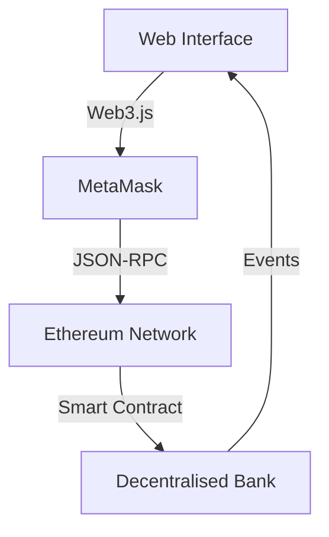

<h1 align="center">
  <br>
  <a href="https://github.com/VagabondBushido/decentralised-Bank">
    
  </a>
  <br>
  Decentralised Bank
  <br>
</h1>

<h4 align="center">A Modern Web3 Banking Experience Built on <a href="https://ethereum.org" target="_blank">Ethereum</a></h4>

<p align="center">
  <a href="#key-features">
    
  </a>
  <a href="#how-to-use">
    
  </a>
  <a href="https://opensource.org/licenses/MIT">
    
  </a>
</p>

<p align="center">
  <a href="#key-features">Key Features</a> •
  <a href="#demo">Demo</a> •
  <a href="#how-to-use">How To Use</a> •
  <a href="#tech-stack">Tech Stack</a> •
  <a href="#credits">Credits</a>
</p>

<div align="center">
  
</div>

## ⚡ Key Features

<div align="center">
  <table>
    <tr>
      <td align="center">
        
        <br />
        <b>Secure Wallet</b>
        <br />
        MetaMask Integration
      </td>
      <td align="center">
        
        <br />
        <b>Fast Transactions</b>
        <br />
        Instant Transfers
      </td>
      <td align="center">
        
        <br />
        <b>Bank Grade Security</b>
        <br />
        Audited Smart Contracts
      </td>
    </tr>
  </table>
</div>

## 🎥 Demo

<div align="center">
  <a href="https://www.youtube.com/watch?v=zvCgCukIsIs">
    
  </a>
  <p>👆 Click the image above to watch the demo video</p>
</div>

## 🚀 Tech Stack

<div align="center">
  
  <br />
  
</div>

### Smart Contract
```solidity
// Simplified view of our main contract
contract DecentralisedBank {
    mapping(address => uint256) public balances;
    
    event Deposit(address indexed user, uint256 amount);
    event Withdrawal(address indexed user, uint256 amount);
    event Transfer(address indexed from, address indexed to, uint256 amount);
    
    function deposit() public payable {
        balances[msg.sender] += msg.value;
        emit Deposit(msg.sender, msg.value);
    }
    // ... more functions
}
```

## 💫 How To Use

<div align="center">

[](https://vercel.com/new/clone?repository-url=https%3A%2F%2Fgithub.com%2FVagabondBushido%2Fdecentralised-Bank)

</div>

```bash
# Clone this repository
$ git clone https://github.com/VagabondBushido/decentralised-Bank

# Install dependencies
$ cd decentralised-Bank
$ npm install

# Run the dapp
$ npm run dev
```

## 🌐 Architecture

<div align="center">
  
</div>



## 🔐 Security Features

<div align="center">
  <table>
    <tr>
      <td align="center" width="33%">
        
        <br />
        <b>Audited Code</b>
      </td>
      <td align="center" width="33%">
        
        <br />
        <b>Encrypted Data</b>
      </td>
      <td align="center" width="33%">
        
        <br />
        <b>Attack Protection</b>
      </td>
    </tr>
  </table>
</div>

## ⭐ Key Benefits

- 🏦 **Decentralized Banking**: No central authority
- 💸 **Low Fees**: Minimal transaction costs
- 🔒 **Security First**: Built with security in mind
- ⚡ **Fast Transactions**: Quick transfer times
- 🌐 **Global Access**: Available worldwide
- 📱 **Mobile Ready**: Responsive design

## 🎯 Roadmap

<div align="center">
  <table>
    <tr>
      <td align="center">✅</td>
      <td>Smart Contract Development</td>
    </tr>
    <tr>
      <td align="center">✅</td>
      <td>Web Interface</td>
    </tr>
    <tr>
      <td align="center">🏗️</td>
      <td>Mobile App Integration</td>
    </tr>
    <tr>
      <td align="center">📅</td>
      <td>Multi-chain Support</td>
    </tr>
  </table>
</div>

## 🤝 Contributing

<div align="center">
  
</div>

1. Fork it (<https://github.com/VagabondBushido/decentralised-Bank/fork>)
2. Create your feature branch (`git checkout -b feature/amazing`)
3. Commit your changes (`git commit -am 'Add amazing feature'`)
4. Push to the branch (`git push origin feature/amazing`)
5. Create a new Pull Request

## 📜 License

<div align="center">
  
Released under the [MIT](LICENSE) License

<br />


<br />

<sub>Built with ❤️ by [VagabondBushido](https://github.com/VagabondBushido)</sub>

</div>

---

> GitHub [@VagabondBushido](https://github.com/VagabondBushido) &nbsp;&middot;&nbsp;
> Twitter [@VagabondBushido](https://twitter.com/VagabondBushido)
